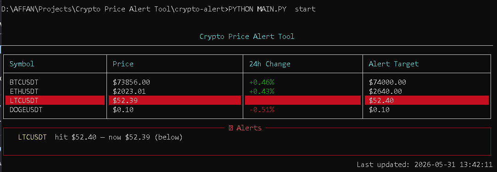

# Crypto Price Alert Tool

A terminal dashboard that tracks live crypto prices from Binance and alerts you when a coin hits your target.

<p align="center">
    <a href="https://www.python.org/">
        
    </a>
    <br/>
    <a href="https://github.com/Affaniqbal234/crypto-price-alert">
        
    </a>
    <a href="https://github.com/Affaniqbal234/crypto-price-alert/blob/main/LICENSE">
        
    </a>
</p>

---

## Features

- Live prices from Binance (no API key needed)
- 24h % change with color coding
- Set target prices and get alerted when crossed
- Auto-refreshes every 10 seconds (configurable)
- Clean terminal UI powered by `rich`
- Watchlist saved locally in JSON

---

## Installation

```bash
git clone https://github.com/Affaniqbal234/crypto-price-alert.git
cd crypto-price-alert
pip install -r requirements.txt
```

---

## Usage

```bash
# Add coins to your watchlist
python main.py add BTCUSDT
python main.py add ETHUSDT --target 4000

# Remove a coin
python main.py remove ETHUSDT

# Launch the dashboard
python main.py start

# Custom refresh interval
python main.py start --interval 5
```

---

## Screenshot



---

## Running Tests

```bash
pip install -r requirements-dev.txt
pytest tests/
```
